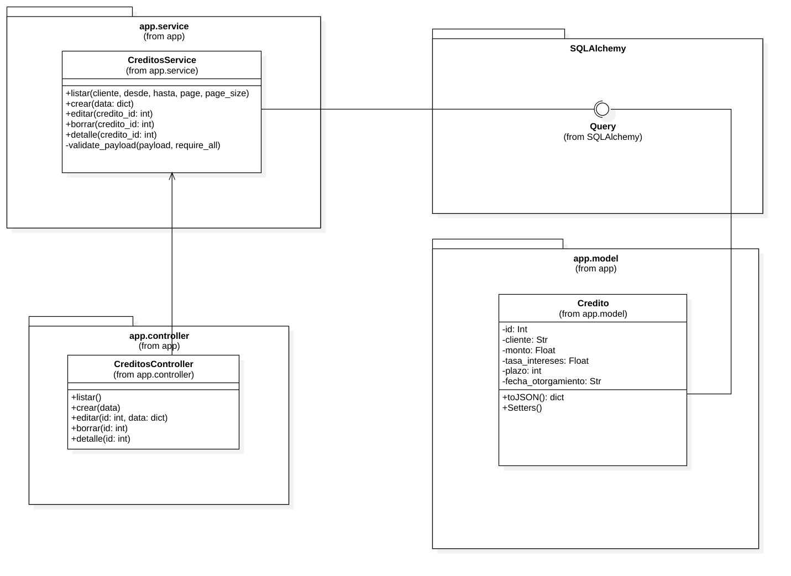
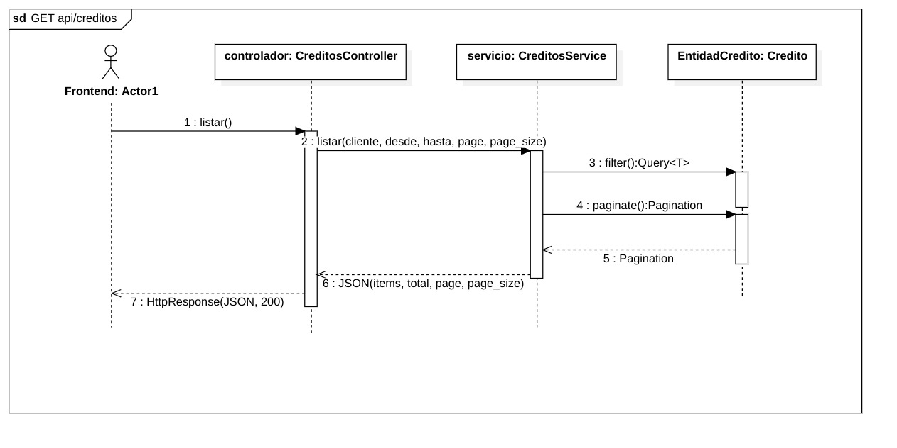
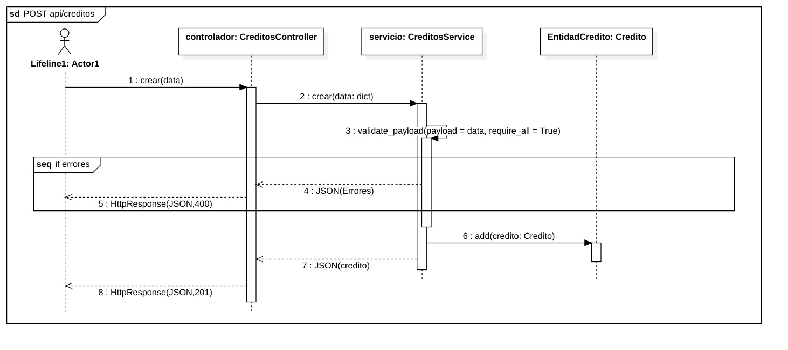
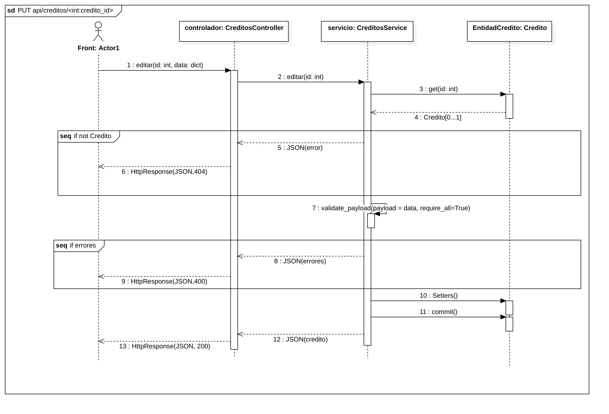
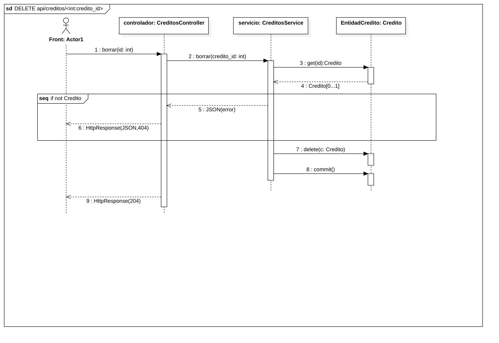
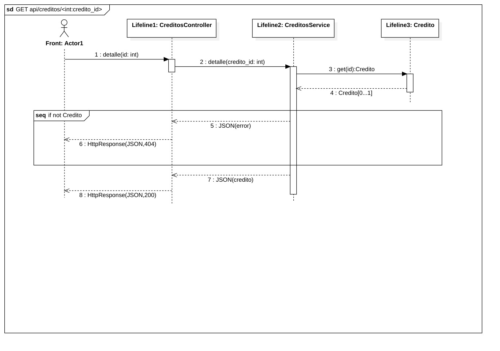

# 📊 Registro de Créditos (Flask + SQLite + Chart.js)
Aplicación web desarrollada en Python (Flask) con SQLite que permite:
- Registrar nuevos créditos.
- Listar, editar y eliminar créditos existentes.
- Filtrar por cliente y rango de fechas.
- Visualizar un dashboard interactivo con:
    - Evolución de todos los créditos otorgados.
    - Distribución de créditos por cliente.
    - Distribución por rangos de monto.

Interfaz construida con HTML + CSS + JavaScript y gráficas con Chart.js.

---

## 🚀 Tecnologías usadas
- Backend: Python 3.12, Flask, Flask-SQLAlchemy, Flask-Migrate
- Base de datos: SQLite
- Frontend: HTML, CSS, JavaScript, Chart.js
- Contenedores: Docker
- Servidor: Gunicorn (modo producción en Docker)

---

## 🐳 Ejecución con Docker
1. Construir imagen

``` bash
docker build -t registro-creditos .
```

2. Crear carpeta para persistencia en la base de datos
    - Linux 

    ``` bash
    mkdir -p data
    ```

    - Windows

    ``` bash
    mkdir data
    ```

3. Sembrar datos aleatorios de ejemplo (Opcional)
    - Linux
    ``` bash
    docker run --rm \
    -e DATABASE_URL="sqlite:////data/app.db" \
    -v "$(pwd)/data:/data" \
    -w /app \
    --entrypoint sh \
    registro-creditos -lc "flask db upgrade && python seed.py"
    ```
    - Windows
    ``` bash
    docker run --rm `
    -e DATABASE_URL="sqlite:////data/app.db" `
    -v "$(pwd)/data:/data" `
    -w /app --entrypoint sh `
    registro-creditos -lc "flask db upgrade && python seed.py"
    ```
4. Ejecutar la app
    - Linux
    ``` bash
    docker run -it --rm -p 5000:5000 \
    -e DATABASE_URL="sqlite:////data/app.db" \
    -v "$(pwd)/data:/data" \
    registro-creditos
    ```
    - Windows
    ``` bash
    docker run -it --rm -p 5000:5000 `
    -e DATABASE_URL="sqlite:////data/app.db" `
    -v "$(pwd)/data:/data" `
    registro-creditos
    ```
    - Abrir en el navegador: [http://localhost:5000/app](http://localhost:5000/app)

---

## 📐 Documentación UML

El proyecto incluye diagramas UML para ilustrar la arquitectura y el flujo de la aplicación:
- Diagrama de clases: describe la estructura del dominio, incluyendo entidades, servicios y controladores.
- Diagramas de secuencia: uno por cada operación principal del API REST:
    - GET /api/creditos → Listar créditos
    - POST /api/creditos → Crear crédito
    - PUT /api/creditos/{id} → Editar crédito
    - DELETE /api/creditos/{id} → Eliminar crédito
    - GET /api/creditos/{id} → Detalle de crédito

Los diagramas están disponibles en la carpeta [DiagramasUML](./DiagramasUML/) y sirven como apoyo para entender el diseño y la interacción entre capas.

### 📐 Diagrama de clases


### 📑 Diagrama de secuencia: Listar créditos


### 📑 Diagrama de secuencia: Crear crédito


### 📑 Diagrama de secuencia: Editar crédito


### 📑 Diagrama de secuencia: Borrar crédito


### 📑 Diagrama de secuencia: Detalle crédito


